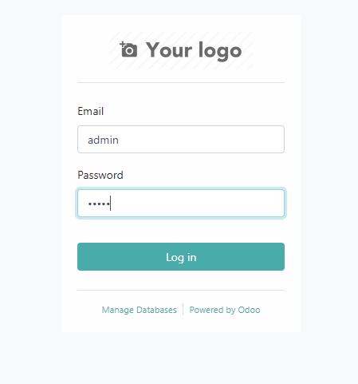

# Marcel's Odoo Source Code Deployment
This project started by taking Odoo v14 and containerising the source code. The project aims to automate the process of initialising a fully functioning production ready system that is served from docker containers. Docker offers us the ability to automate and deploy a fairly heavy system in a matter of minutes, this coupled with deployment scripts is extremely advantageous in leveraging the current functionality provided by Odoo.

<a id="table-of-contents"></a>
## Table of Contents
<ol style="list-style-type: none;">
  <li>
    1. <a href="#UX">User Experience</a>
    <ol style="list-style-type: none;">
      <li>1.1. Strategy</li>
      <li>1.2. Structure</li>
    </ol>
  </li>
  <li>
    2. <a href="#features">Features</a>
    <ol style="list-style-type: none;">
      <li>2.1. Current</li>
      <li>2.2. Next phase</li>
    </ol>
  </li>
  <li>3. <a href="#technologies-used">Technologies Used</a></li>
  <li>4. <a href="#testing">Testing</a></li>
  <li>5. <a href="#deployment">Deployment</a></li>
  <li>6. <a href="#development-cycle">Development Cycle</a></li>
  <li>7. <a href="#end-product">End Product</a></li>
  <li>8. <a href="#known-bugs">Known Bugs</a></li>
  <li>9. <a href="#credits">Credits</a></li>
  <li>10. <a href="#fundamentals">Fundamentals</a></li>
</ol>

<a id="UX"></a>

## 1. User Experience

<a href="#table-of-contents"><i>Go to the top</i></a>

The user experience encompasses aspects of how the customer interacts with the product.

### 1.1. Strategy
The purpose of this project is to shorten the learning curve of deploying / developing with Odoo's source code.
The project achieves this goal by providing scripts to be run on linux machines. Additionally, using docker allows packages and source code to be automatically built cutting down the time required to initialise your project and isolating dependencies.

### 1.2. Structure
The structure illustrated below is to showcase the primary files of concerns in this project.
```
.
└── _ ODOO-BASE-DEVELOPMENT
    ├── Dockerfile
    ├── docker-compose.yml
    ├── getting-started-scripts.sh
    └── virtual-box-setup-script.sh
```

<a id="features"></a>

## 2. Features

<a href="#table-of-contents"><i>Go to the top</i></a>

### 2.1. Current

- A deployment script (`virtual-box-setup-script.sh`) for setting up the VM / remote host which will host the docker containers
- A getting started script (`getting-started-script.sh`) for initialising the project through calling the docker-compose configuration YAML
- A Dockerfile and docker-compose file for holding system configurations

### 2.2. Next phase

- A dark mode walk through to illustrate how to amend the existing HTML: see https://www.odoo.com/documentation/14.0/developer/howtos/themes.html
- A walk through illustrating how to build an Odoo module: see https://www.odoo.com/documentation/14.0/developer/howtos/backend.html
- Implement NGINX to handle web traffic and enable HTTPS

<a id="technologies-used"></a>

## 3. Technologies Used

<a href="#table-of-contents"><i>Go to the top</i></a>
- bash
- docker
- docker-compose
- python3.8

<a id="testing"></a>

<!-- ## 4. Testing

<a href="#table-of-contents"><i>Go to the top</i></a>
### Automated Testing
### Manual Testing
### Bugs Resolved -->

<a id="deployment"></a>

## 5. Deployment

<a href="#table-of-contents"><i>Go to the top</i></a>

A lot of the statements made below will mostly be superficial.
1) Build a [Virtual Box](https://www.virtualbox.org/) machine with an [Ubuntu](https://ubuntu.com/download/flavours) image. Make sure that you have at least 2GB of memory and at least 30GB of storage space.
2) Clone this repository into your VM or host machine
3) Run or follow the `virtual-box-setup-script.sh`
4) Once you are back on the machine, run `getting-started-script.sh` - You will now be at a point where you are downloading the Odoo source code from Github. Once this is completed the script will start to build the Odoo docker container, and then start the containers to run Odoo
5) Navigate to your Odoo site at either `http:localhost:9000` OR (if on a VM) `htpp://{VM_HOST}:9000`

Considering that the Odoo walk-through has more than 5 steps I hope that the above significantly reduces your "bring to production time".

Once Odoo was responding on http:localhost:9000 you needed to configure and secure the database, the below steps should be taken:
1) Click on manage database
2) Click on SET MASTER PASSWORD > enter in your master password
3) Go back to login
4) login using username = admin & password = admin
5) Click in top left corner
6) Click on settings
7) Change default admin password
8) Input a more secure password

<a id="development-cycle"></a>

## 6. Development Cycle

<a href="#table-of-contents"><i>Go to the top</i></a>

The first issue I had while working with Odoo was how do I develop the source code. The easy installations involved downloading the binaries on Ubuntu and compiling Odoo from binaries, alternatively, on Windows getting the installation files and running Odoo that way.

A bit of research yielded access to the source code which is mirrored on [GitHub](https://github.com/odoo/odoo). The source code is fairly easy to access, simply clone the repository and there is it. Odoo's documentation on [installing](https://www.odoo.com/documentation/14.0/administration/install.html) from source is fairly explicit. It covers all the necessary requirements and walks the user through the base setup. Sadly, when things do inevitably go wrong, as the documentation is lacking in certain areas, the user has to rely on their own knowledge and that of any forum's that have tried resolving similar issues. One concern raised from the previously mentioned is that the whole concept of installing from source is not packaged, and almost quite raw. Granted the installation is supposed to serve only as a tool for basic development. A work-around is starting an Odoo project using pre-compiled docker images, sadly, this takes you back to the initial problem of altering the source code for your own requirements.

The next stage was therefore to come up with an automated way of getting a development environment, that was built from source code, to be as production ready as possible. These requirement for our production environment fall down on three core frameworks to implement:
1. Odoo source code acting as a web-framework
2. A connected Postgres database, as required by Odoo
3. NGINX to handle incoming web traffic on port 6969 (TBC)

Knowing that this would be the general structure of the project it was time to work towards getting an Odoo container created from the source code using a Dockerfile. The Dockerfile was created following the install Odoo from source walk-through, it therefore assumed that the container was the base machine. The next assumption was that the Postgres database would be externally hosted (i.e. on another machine) and would be connected to using either a .conf file or by passing the parameters. The way that seemed the least painless was by passing the parameters. Originally, attempts were made to link the two containers the recommended docker-compose way through countless tutorials online, sadly, these involved using the pre-built images from docker and linking the within the network. In practice this works well, but, it does not address the initial issue of being able to touch the source code on your production environment.

The resulting efforts yielded a Dockerfile and docker-compose.yml file included in this project. The Dockerfile, as mentioned above, contains all the steps that can be found in the general Odoo walk-through. The docker-compose.yml file contains the initialisation of the Odoo container and Postgres container (other container additions may follow). The containers communicate on a docker network called "odoo-net". The Odoo container is initialised with a base command and passed parameters to get things up and running and to illustrate the possibilities with the base command.

Running Odoo as the root user poses a security risk that needed to be addressed. This is achieved by defining the USER in the Dockerfile. For this we need to include a non-root user which we call odoo. The new odoo user will have to have permission and ownership over the whole project folder.
```
RUN useradd --create-home --password $(perl -e 'print crypt($ARGV[0], "password")' 'odoo') odoo
RUN chown -R odoo:odoo /odoo

USER odoo

```

Another nice to have feature is to enable the SMTP emailing service, by default we have left this blank. Below is a simple guide on how to set this up:
```
SMTP Configuration:
  --email-from=EMAIL_FROM
                      specify the SMTP email address for sending email
  --smtp=SMTP_SERVER  specify the SMTP server for sending email
  --smtp-port=SMTP_PORT
                      specify the SMTP port
  --smtp-ssl          if passed, SMTP connections will be encrypted with SSL
                      (STARTTLS)
  --smtp-user=SMTP_USER
                      specify the SMTP username for sending email
  --smtp-password=SMTP_PASSWORD
                      specify the SMTP password for sending email
```

<a id="end-product"></a>

## 7. End Product

<a href="#table-of-contents"><i>Go to the top</i></a>

Odoo's default login screen



Odoo's default application installation screen


<a id="known-bugs"></a>

## 8. Known Bugs

<a href="#table-of-contents"><i>Go to the top</i></a>

<i>None are registered at this point in time</i>

<a id="credits"></a>

## 9. Credits

<a href="#table-of-contents"><i>Go to the top</i></a>

This section will be used to link to helpful resources that were used along the way. This external resources are not maintained by us, and therefore broken links are a possibility.
- [Odoo GitHub](https://github.com/odoo/odoo)
- [Inspiration for the Dockerfile from Odoo installation documentation](https://www.odoo.com/documentation/14.0/administration/install.html)
- [Enabling an SSH server on Virtual Box](https://linuxize.com/post/how-to-enable-ssh-on-ubuntu-18-04/)
- [Virtual box network setup](https://bobcares.com/blog/virtualbox-ssh-nat/)
- [Connecting to GitHub using SSH](https://docs.github.com/en/github/authenticating-to-github/connecting-to-github-with-ssh)
- [Installing docker](https://docs.docker.com/engine/install/ubuntu/)

<a id="fundamentals"></a>

### 10. Fundamentals

<a href="#table-of-contents"><i>Go to the top</i></a>

To get up and running a few hacks were required to get to a stage where things could be running in an automated fashion. Below is a log of commands / ideas that happened sequentially to get this project to a running stage.
  1) Use the deployment section to get a MVP (minimum viable product) up and running
  2) The below is a list of additional parameters which can be passed to ./odoo-bin
```
Usage: odoo-bin [options]

Options:
  --version             show program's version number and exit
  -h, --help            show this help message and exit

  Common options:
    -c CONFIG, --config=CONFIG
                        specify alternate config file
    -s, --save          save configuration to ~/.odoorc (or to
                        ~/.openerp_serverrc if it exists)
    -i INIT, --init=INIT
                        install one or more modules (comma-separated list, use
                        "all" for all modules), requires -d
    -u UPDATE, --update=UPDATE
                        update one or more modules (comma-separated list, use
                        "all" for all modules). Requires -d.
    --without-demo=WITHOUT_DEMO
                        disable loading demo data for modules to be installed
                        (comma-separated, use "all" for all modules). Requires
                        -d and -i. Default is none
    -P IMPORT_PARTIAL, --import-partial=IMPORT_PARTIAL
                        Use this for big data importation, if it crashes you
                        will be able to continue at the current state. Provide
                        a filename to store intermediate importation states.
    --pidfile=PIDFILE   file where the server pid will be stored
    --addons-path=ADDONS_PATH
                        specify additional addons paths (separated by commas).
    --upgrade-path=UPGRADE_PATH
                        specify an additional upgrade path.
    --load=SERVER_WIDE_MODULES
                        Comma-separated list of server-wide modules.
    -D DATA_DIR, --data-dir=DATA_DIR
                        Directory where to store Odoo data

  HTTP Service Configuration:
    --http-interface=HTTP_INTERFACE
                        Listen interface address for HTTP services. Keep empty
                        to listen on all interfaces (0.0.0.0)
    -p PORT, --http-port=PORT
                        Listen port for the main HTTP service
    --longpolling-port=PORT
                        Listen port for the longpolling HTTP service
    --no-http           Disable the HTTP and Longpolling services entirely
    --proxy-mode        Activate reverse proxy WSGI wrappers (headers
                        rewriting) Only enable this when running behind a
                        trusted web proxy!

  Web interface Configuration:
    --db-filter=REGEXP  Regular expressions for filtering available databases
                        for Web UI. The expression can use %d (domain) and %h
                        (host) placeholders.

  Testing Configuration:
    --test-file=TEST_FILE
                        Launch a python test file.
    --test-enable       Enable unit tests.
    --test-tags=TEST_TAGS
                        Comma-separated list of specs to filter which tests to
                        execute. Enable unit tests if set. A filter spec has
                        the format: [-][tag][/module][:class][.method] The '-'
                        specifies if we want to include or exclude tests
                        matching this spec. The tag will match tags added on a
                        class with a @tagged decorator (all Test classes have
                        'standard' and 'at_install' tags until explicitly
                        removed, see the decorator documentation). '*' will
                        match all tags. If tag is omitted on include mode, its
                        value is 'standard'. If tag is omitted on exclude
                        mode, its value is '*'. The module, class, and method
                        will respectively match the module name, test class
                        name and test method name. Example: --test-tags
                        :TestClass.test_func,/test_module,external Filtering
                        and executing the tests happens twice: right after
                        each module installation/update and at the end of the
                        modules loading. At each stage tests are filtered by
                        --test-tags specs and additionally by dynamic specs
                        'at_install' and 'post_install' correspondingly.
    --screencasts=DIR   Screencasts will go in DIR/{db_name}/screencasts.
    --screenshots=DIR   Screenshots will go in DIR/{db_name}/screenshots.
                        Defaults to /tmp/odoo_tests.

  Logging Configuration:
    --logfile=LOGFILE   file where the server log will be stored
    --syslog            Send the log to the syslog server
    --log-handler=PREFIX:LEVEL
                        setup a handler at LEVEL for a given PREFIX. An empty
                        PREFIX indicates the root logger. This option can be
                        repeated. Example: "odoo.orm:DEBUG" or
                        "werkzeug:CRITICAL" (default: ":INFO")
    --log-request       shortcut for --log-handler=odoo.http.rpc.request:DEBUG
    --log-response      shortcut for --log-
                        handler=odoo.http.rpc.response:DEBUG
    --log-web           shortcut for --log-handler=odoo.http:DEBUG
    --log-sql           shortcut for --log-handler=odoo.sql_db:DEBUG
    --log-db=LOG_DB     Logging database
    --log-db-level=LOG_DB_LEVEL
                        Logging database level
    --log-level=LOG_LEVEL
                        specify the level of the logging. Accepted values:
                        ['info', 'debug_rpc', 'warn', 'test', 'critical',
                        'runbot', 'debug_sql', 'error', 'debug',
                        'debug_rpc_answer', 'notset'].

  SMTP Configuration:
    --email-from=EMAIL_FROM
                        specify the SMTP email address for sending email
    --smtp=SMTP_SERVER  specify the SMTP server for sending email
    --smtp-port=SMTP_PORT
                        specify the SMTP port
    --smtp-ssl          if passed, SMTP connections will be encrypted with SSL
                        (STARTTLS)
    --smtp-user=SMTP_USER
                        specify the SMTP username for sending email
    --smtp-password=SMTP_PASSWORD
                        specify the SMTP password for sending email

  Database related options:
    -d DB_NAME, --database=DB_NAME
                        specify the database name
    -r DB_USER, --db_user=DB_USER
                        specify the database user name
    -w DB_PASSWORD, --db_password=DB_PASSWORD
                        specify the database password
    --pg_path=PG_PATH   specify the pg executable path
    --db_host=DB_HOST   specify the database host
    --db_port=DB_PORT   specify the database port
    --db_sslmode=DB_SSLMODE
                        specify the database ssl connection mode (see
                        PostgreSQL documentation)
    --db_maxconn=DB_MAXCONN
                        specify the maximum number of physical connections to
                        PostgreSQL
    --db-template=DB_TEMPLATE
                        specify a custom database template to create a new
                        database

  Internationalisation options. :
    Use these options to translate Odoo to another language. See i18n
    section of the user manual. Option '-d' is mandatory. Option '-l' is
    mandatory in case of importation

    --load-language=LOAD_LANGUAGE
                        specifies the languages for the translations you want
                        to be loaded
    -l LANGUAGE, --language=LANGUAGE
                        specify the language of the translation file. Use it
                        with --i18n-export or --i18n-import
    --i18n-export=TRANSLATE_OUT
                        export all sentences to be translated to a CSV file, a
                        PO file or a TGZ archive and exit
    --i18n-import=TRANSLATE_IN
                        import a CSV or a PO file with translations and exit.
                        The '-l' option is required.
    --i18n-overwrite    overwrites existing translation terms on updating a
                        module or importing a CSV or a PO file.
    --modules=TRANSLATE_MODULES
                        specify modules to export. Use in combination with
                        --i18n-export

  Security-related options:
    --no-database-list  Disable the ability to obtain or view the list of
                        databases. Also disable access to the database manager
                        and selector, so be sure to set a proper --database
                        parameter first

  Advanced options:
    --dev=DEV_MODE      Enable developer mode. Param: List of options
                        separated by comma. Options : all,
                        [pudb|wdb|ipdb|pdb], reload, qweb, werkzeug, xml
    --shell-interface=SHELL_INTERFACE
                        Specify a preferred REPL to use in shell mode.
                        Supported REPLs are: [ipython|ptpython|bpython|python]
    --stop-after-init   stop the server after its initialization
    --osv-memory-count-limit=OSV_MEMORY_COUNT_LIMIT
                        Force a limit on the maximum number of records kept in
                        the virtual osv_memory tables. The default is False,
                        which means no count-based limit.
    --transient-age-limit=TRANSIENT_AGE_LIMIT
                        Time limit (decimal value in hours) records created
                        with a TransientModel (mosly wizard) are kept in the
                        database. Default to 1 hour.
    --osv-memory-age-limit=OSV_MEMORY_AGE_LIMIT
                        Deprecated alias to the transient-age-limit option
    --max-cron-threads=MAX_CRON_THREADS
                        Maximum number of threads processing concurrently cron
                        jobs (default 2).
    --unaccent          Try to enable the unaccent extension when creating new
                        databases.
    --geoip-db=GEOIP_DATABASE
                        Absolute path to the GeoIP database file.

  Multiprocessing options:
    --workers=WORKERS   Specify the number of workers, 0 disable prefork mode.
    --limit-memory-soft=LIMIT_MEMORY_SOFT
                        Maximum allowed virtual memory per worker (in bytes),
                        when reached the worker be reset after the current
                        request (default 2048MiB).
    --limit-memory-hard=LIMIT_MEMORY_HARD
                        Maximum allowed virtual memory per worker (in bytes),
                        when reached, any memory allocation will fail (default
                        2560MiB).
    --limit-time-cpu=LIMIT_TIME_CPU
                        Maximum allowed CPU time per request (default 60).
    --limit-time-real=LIMIT_TIME_REAL
                        Maximum allowed Real time per request (default 120).
    --limit-time-real-cron=LIMIT_TIME_REAL_CRON
                        Maximum allowed Real time per cron job. (default:
                        --limit-time-real). Set to 0 for no limit.
    --limit-request=LIMIT_REQUEST
                        Maximum number of request to be processed per worker
                        (default 8192).
```

  3) You can get into the odoo docker container by running `docker exec -it odoo /bin/bash` once in the container you can connect to Postgres using the Postgres client that we ship with the Odoo container:
```
psql -h <REMOTE HOST> -p <REMOTE PORT> -U <DB_USER> <DB_NAME>
```